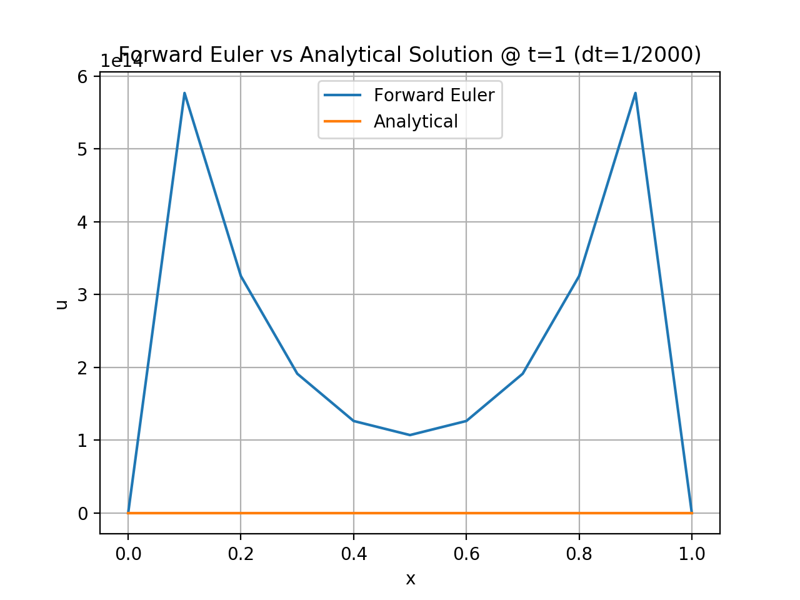

# COE352-FEM-Project

### 1. Solve first by using a forward Euler time derivative discretization with a time-step of dt = 1/551. Plot the results at the final time. Increase the time-step until you find the instability. What dt does this occur at? How does the solution change as N decreases?

At a time step of dt = 1/551, the forward Euler results are unstable, as you can see from the plot below. If we increase the timestep, as demonstrated with the plots of dt = 1/500 and 1/400, the results remain unstable and do not converge to the analytical solution.

However, if we decrease the timestep to dt = 1/560, the solution converges to a result close to the analytical solution. This is the closest point to stability I could find.

If we continute to decrease the timestep, the computed solution gets further from the analytical solution, but does not demonstrate the oscillatory pattern shown or the 'blowing up' effect shown by dt's of 1/551 and greater. 

However, at a certain point, computed solutions with smaller dt's do not demonstrate the pattern of the analytical solution and begin to increase in magnitude, as shown by the plot below, with a dt of 1/2000.

As you can see from the two plots below, simply increasing the number of nodes makes this method even worse, as even the most stable timestep, 1/560, returns to the oscillating pattern between extreme values.

### 2. Solve the same problem with the same time-steps using an implicit backward Euler.­  What happens as the time-step is equal to or greater than the spatial step size?  Explain why.

The backward Euler solution converges to values extremely close to the analytical solution, as demonstrated by the plot below, demonstrating the results with a timestep of dt = 1/551. For comparison, I included the plots of the same timesteps used with forward Euler, with all fitting the analytical solution much more closely.

When the timestep is equal to the spatial step size, dt = 1/10, the backward Euler does not model the analytical solution accurately, either in shape or in magnitude. Additionally, the method continues to get worse when greater than the spatial step size, as shown by the plot of dt = 1/5. This is because the growth factor for these two time steps is 10 and 20, respectively, when it should be below 0.5 for stability.

